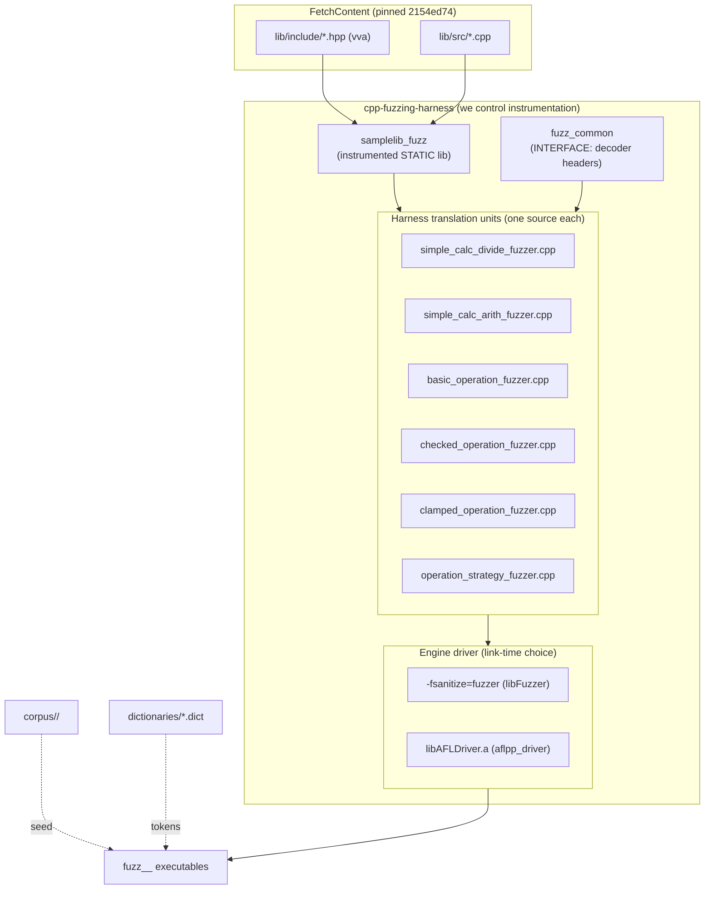

# Design Document — cpp-fuzzing-harness

**Project:** `vladiant/cpp-fuzzing-harness` · **Document type:** Design Specification (Design stage) · **Status:** Draft for C++ Developer hand-off · **Date:** 2026-10-04 · **Author role:** System Architect

**Upstream under test:** `vladiant/test_cpp_ci` — `SampleLib` (namespace `vva`), pinned to commit `2154ed741002263b493eb15fd8c1a419117adfa5`.

**Source SRS:** `docs/requirements/srs.md` (approved). This document realizes FR-1…FR-20 and NFR-1…NFR-9 as a concrete, implementable layout. It specifies **structure, interfaces, CMake targets, and workflows only** — no production code.

---

## 1. Architecture Overview

### 1.1 Guiding principles

- **Single-source, dual-engine (FR-7/10/11).** Every harness is one `.cpp` exposing `LLVMFuzzerTestOneInput`. The *engine* (libFuzzer vs AFL++) and the *sanitizer set* (ASan+UBSan / MSan) are build-configuration choices, never source forks.
- **We own the instrumentation boundary (FR-19/20, NFR-5).** Upstream is fetched read-only at the pinned commit and recompiled *inside this project* with our sanitizer/coverage flags. We deliberately do **not** adopt upstream's app/test/coverage/valgrind targets.
- **Thin, testable harness layer.** Byte-decoding logic (`FuzzedDataProvider`-style) is isolated in a header-only helper that is itself unit-tested with GoogleTest — the only part of this repo that can have logic bugs, so it is the only part that needs its own tests (testability per Workflow §5).
- **Minimal coupling.** Harnesses depend on (a) the instrumented SampleLib and (b) the common decoder header — nothing else. No global singletons; the `OperationStrategy` harness constructs its collaborator by value/stack and injects it (dependency injection, not a registry).

### 1.2 Component diagram (Mermaid)



### 1.3 Component responsibilities

| Component | Responsibility | Owns |
|-----------|----------------|------|
| `samplelib_fuzz` | Recompile upstream `lib/src/*.cpp` with our sanitizer + coverage flags; expose `lib/include` publicly | Instrumentation of the code under test |
| `fuzz_common` | `FuzzedDataProvider`-style byte→operand decoding; shared harness prelude macros | Input-domain mapping (FR-8) |
| `*_fuzzer.cpp` | Map decoded operands onto one upstream API; encode the *contract* (which exceptions are DEFINED) | Target-exercising logic |
| Engine driver | Supply `main()` + feedback loop | Engine integration (FR-7/9/10) |
| `corpus/`, `dictionaries/` | Seed inputs & boundary tokens | Coverage bootstrap (FR-15/16) |
| `tests/` | Unit-test the decoder helper | Harness-infrastructure correctness (NFR-6) |

---

## 2. Project Directory Tree

```
cpp-fuzzing-harness/
├── CMakeLists.txt                     # root; orchestrates options, FetchContent, targets
├── CMakePresets.json                  # libfuzzer-asan-ubsan / afl / msan presets
├── conanfile.py                       # Conan 2: only GTest (for the decoder unit tests)
├── cmake/
│   ├── FetchUpstream.cmake            # FetchContent_Declare/MakeAvailable (GIT_TAG = pinned SHA)
│   ├── Sanitizers.cmake               # ENABLE_ASAN/ENABLE_UBSAN/ENABLE_MSAN -> flag fragments
│   ├── FuzzingEngine.cmake            # FUZZING_ENGINE handling + AFL driver discovery
│   └── AddFuzzHarness.cmake           # add_fuzz_harness() helper function
├── fuzz/
│   ├── common/
│   │   ├── fuzzed_data_provider.hpp   # byte-stream reader (header-only)
│   │   ├── operand_decoder.hpp        # typed int16_t operand + op-selector extraction
│   │   └── harness_prelude.hpp        # FUZZ_GUARD macros, catch-defined-exception helper
│   ├── simple_calc_divide_fuzzer.cpp  # FR-1
│   ├── simple_calc_arith_fuzzer.cpp   # FR-2
│   ├── basic_operation_fuzzer.cpp     # FR-3
│   ├── checked_operation_fuzzer.cpp   # FR-4
│   ├── clamped_operation_fuzzer.cpp   # FR-5
│   └── operation_strategy_fuzzer.cpp  # FR-6
├── corpus/
│   ├── simple_calc_divide/            # seed files (FR-15)
│   ├── simple_calc_arith/
│   ├── basic_operation/
│   ├── checked_operation/
│   ├── clamped_operation/
│   └── operation_strategy/
├── dictionaries/
│   ├── int16_boundaries.dict          # FR-16
│   └── operations.dict
├── tests/
│   ├── CMakeLists.txt                 # GTest target for the decoder
│   └── test_operand_decoder.cpp
├── scripts/
│   ├── run_libfuzzer.sh               # configure+build+run one target (libFuzzer)
│   ├── run_afl.sh                     # configure+build+run one target (AFL++, CI)
│   └── reproduce.sh                   # replay a persisted crash (FR-17)
├── docs/
│   ├── requirements/srs.md
│   └── design/design.md               # this document
└── .github/
    └── workflows/
        └── fuzz.yml                   # libFuzzer job (ubuntu) + AFL++ job (ubuntu+sudo)
```

> **Note:** there is no local `src/` for upstream code — the code under test is populated by FetchContent into the build tree and compiled by `samplelib_fuzz` (see §4.2). This keeps the repo free of vendored copies (FR-20, NFR-5).

---

## 3. Key Interfaces & Contracts

> **Developer action (verify against pinned headers):** the exact upstream signatures below are reconstructed from SRS §1.2. Before implementing, confirm them against the fetched `lib/include/*.hpp` at commit `2154ed74…`. Where the real names differ, adapt the harness call sites only — the harness *structure* and the DEFINED-vs-UB contract are what matter and must not change. Flag any API mismatch back through the normal channel (do not expand scope).

### 3.1 Code-under-test contract (namespace `vva`)

| Target | Expected API shape | Behavior contract the harness encodes |
|--------|--------------------|---------------------------------------|
| `simple_calc` free fns | `add/subtract/multiply/divide(int, int)` (or `int16_t` — confirm) | **UB EXPECTED.** Signed overflow and `divide(x,0)` / `INT_MIN/-1` are undefined → sanitizer should fire. Harness must **not** guard these. |
| `BasicOperationWarper` | ctor + op methods over `int16_t` | **UB EXPECTED.** Same overflow / div-by-zero / `INT16_MIN / -1` UB. No guards. |
| `CheckedOperationWarper` | op methods that `throw` on range/zero | **DEFINED via exceptions.** Throws `std::overflow_error` / `std::underflow_error` / `std::invalid_argument`. Harness **must catch `std::exception`** so these do not register as crashes (FR-4, AC-6). |
| `ClampedOperationWarper` | op methods that clamp, throw on div-by-zero | **DEFINED.** Clamps on overflow (no throw); throws only on div-by-zero. Harness **must catch `std::exception`** (FR-5, AC-6). |
| `IOperationWarper` | abstract base: `operator()` / op virtuals | Injection point for `OperationStrategy`. |
| `OperationStrategy` | `explicit OperationStrategy(IOperationWarper&)`; `operator()(a,b)` → delegates with divisor `(a-b)` | **UB EXPECTED** when `a == b` (divide by zero). Harness injects a `BasicOperationWarper` (unchecked) so the zero-divisor reaches real UB; **no guard** on the `a==b` path. |

### 3.2 Input-decoding contract — `fuzz/common/operand_decoder.hpp`

The decoder turns the raw `(const uint8_t* data, size_t size)` buffer into typed operands deterministically, bounding all work (FR-8, NFR-6). Pseudocode signatures only:

```cpp
namespace fuzz {

// Thin, non-owning cursor over the fuzzer-provided buffer. Value type; no heap.
class FuzzedDataProvider {
 public:
  FuzzedDataProvider(const uint8_t* data, size_t size) noexcept;   // non-owning view

  // Consumes sizeof(T) bytes LE; returns 0-filled value when buffer is exhausted
  // (never reads OOB, never throws) -> satisfies "handle empty/undersized input".
  template <class T> T consume_integral() noexcept;

  uint8_t  consume_byte() noexcept;
  size_t   remaining() const noexcept;

 private:
  const uint8_t* cursor_;
  const uint8_t* end_;
};

// Decoded operand pair + an operation selector for multiplexed harnesses (FR-2).
struct OperandPair {
  int16_t a;
  int16_t b;
};

// Pulls two int16_t operands (little-endian) from the stream.
OperandPair decode_pair(FuzzedDataProvider& fdp) noexcept;

// 0..3 selector for add/subtract/multiply/divide multiplexing.
enum class Op : uint8_t { Add = 0, Subtract = 1, Multiply = 2, Divide = 3 };
Op decode_op(FuzzedDataProvider& fdp) noexcept;

}  // namespace fuzz
```

**Contract guarantees (unit-tested in `tests/`):**
1. `consume_integral<int16_t>()` never reads out of bounds and returns deterministic 0-fill on exhaustion (empty/undersized input → no spurious crash; AC exercises FR-8).
2. Decoding is pure and stable: identical bytes → identical operands (reproducibility, FR-17/NFR-3).
3. No allocation, no recursion, no input-controlled loop bounds (NFR-6 — fuzzer timeouts/OOMs mean *real* target issues).

> **Reuse vs. LLVM's `FuzzedDataProvider.h`:** We ship our own minimal header rather than depending on LLVM's.
> **Trade-off:** LLVM's is battle-tested but drags in a compiler-shipped header whose path varies across clang packagings and it is MSan/AFL-agnostic in subtle ways. Our ~40-line version is trivial, portable across clang 18 / afl-clang-fast++, and — crucially — **unit-testable in isolation** (it is the only logic we own). **Chosen:** own header.

### 3.3 Harness prelude — `fuzz/common/harness_prelude.hpp`

Provides the shared idioms so each harness is ~10 lines:

```cpp
// Catches DEFINED exceptions for checked/clamped targets so the sanitizer
// does not false-positive (FR-4/FR-5). Only std::exception is swallowed;
// anything else (or a sanitizer abort) still crashes the process.
#define FUZZ_EXPECT_DEFINED_EXCEPTIONS(expr)              \
  try { (void)(expr); }                                  \
  catch (const std::exception&) { /* defined behavior */ }

// For UB-expected targets we do NOT wrap the call — UB must reach the sanitizer.
```

Rationale: encoding the contract in a named macro makes the *intent* (DEFINED vs UB-expected) explicit and greppable, and prevents a developer from accidentally wrapping a UB target in a try/catch (which would mask real findings).

### 3.4 Harness skeleton (applies to all six)

```cpp
#include <cstdint>
#include <cstddef>
#include "common/fuzzed_data_provider.hpp"
#include "common/operand_decoder.hpp"
#include "common/harness_prelude.hpp"
#include "<upstream header>"       // e.g. simple_calc.hpp

extern "C" int LLVMFuzzerTestOneInput(const uint8_t* data, size_t size) {
  fuzz::FuzzedDataProvider fdp(data, size);
  const auto [a, b] = fuzz::decode_pair(fdp);

  // UB-EXPECTED target  -> call directly (no guard):
  //     (void)vva::divide(a, b);
  // DEFINED target       -> guard:
  //     FUZZ_EXPECT_DEFINED_EXCEPTIONS(checked.divide(a, b));
  return 0;   // non-zero reserved; always 0 per libFuzzer convention
}
```

| File | Target | Guard? |
|------|--------|--------|
| `simple_calc_divide_fuzzer.cpp` | `vva::divide` + `INT_MIN/-1` | **No guard** (UB expected) |
| `simple_calc_arith_fuzzer.cpp` | `add`/`subtract`/`multiply` via `decode_op` | **No guard** (UB expected) |
| `basic_operation_fuzzer.cpp` | `BasicOperationWarper` all ops | **No guard** (UB expected) |
| `checked_operation_fuzzer.cpp` | `CheckedOperationWarper` all ops | **Guard** (defined throws) |
| `clamped_operation_fuzzer.cpp` | `ClampedOperationWarper` all ops | **Guard** (div-by-zero throw defined) |
| `operation_strategy_fuzzer.cpp` | `OperationStrategy` over an injected `BasicOperationWarper` | **No guard** (`a==b` UB expected) |

---

## 4. CMake Target Layout

### 4.1 Build-level options (cache variables)

| Option | Values | Default | Effect |
|--------|--------|---------|--------|
| `FUZZING_ENGINE` | `libfuzzer` \| `afl` | `libfuzzer` | Selects driver & required compiler for the whole build tree (§4.4) |
| `ENABLE_ASAN` | `ON`/`OFF` | `ON` | AddressSanitizer on lib + harness |
| `ENABLE_UBSAN` | `ON`/`OFF` | `ON` | UndefinedBehaviorSanitizer on lib + harness |
| `ENABLE_MSAN` | `ON`/`OFF` | `OFF` | MemorySanitizer (mutually exclusive with ASan; §6.3) |
| `AFL_DRIVER_PATH` | path | auto-detect | Override location of `libAFLDriver.a` |

**Guard rails enforced in CMake:** `ENABLE_MSAN=ON` with `ENABLE_ASAN=ON` → `message(FATAL_ERROR …)` (C-4). `FUZZING_ENGINE=afl` with a non-`afl-clang-*` compiler → `FATAL_ERROR` with guidance.

### 4.2 Upstream consumption — FetchContent (`cmake/FetchUpstream.cmake`)

```cmake
include(FetchContent)
FetchContent_Declare(
  test_cpp_ci
  GIT_REPOSITORY https://github.com/vladiant/test_cpp_ci.git
  GIT_TAG        2154ed741002263b493eb15fd8c1a419117adfa5   # pinned (FR-19/20)
)
# POPULATE ONLY — do NOT MakeAvailable (that would add upstream's app/test/
# coverage/valgrind targets). We want the sources, not the build.
FetchContent_GetProperties(test_cpp_ci)
if(NOT test_cpp_ci_POPULATED)
  FetchContent_Populate(test_cpp_ci)   # downloads to ${test_cpp_ci_SOURCE_DIR}
endif()
```

Then **this project** defines the instrumented library from the fetched tree:

```cmake
file(GLOB SAMPLELIB_SOURCES CONFIGURE_DEPENDS
     "${test_cpp_ci_SOURCE_DIR}/lib/src/*.cpp")

add_library(samplelib_fuzz STATIC ${SAMPLELIB_SOURCES})
target_include_directories(samplelib_fuzz PUBLIC
     "${test_cpp_ci_SOURCE_DIR}/lib/include")
target_compile_features(samplelib_fuzz PUBLIC cxx_std_17)   # confirm std vs upstream
# Sanitizer + coverage instrumentation applied identically here and on harnesses:
target_fuzzing_instrumentation(samplelib_fuzz)              # helper from §4.3
add_library(fuzz::samplelib ALIAS samplelib_fuzz)
```

> **Design decision — `FetchContent_Populate` + own target vs. `add_subdirectory`/`MakeAvailable`.**
> - *`MakeAvailable`/`add_subdirectory`* would pull in `SampleLibApp`, `TestSampleLib`, and upstream's coverage/valgrind machinery, polluting our target graph, slowing configure, and — worst — building the code under test with *upstream's* flags rather than our sanitizer/coverage flags. We would then have no clean way to guarantee `-fsanitize=fuzzer-no-link` coverage instrumentation reaches `lib/src`.
> - *Populate-only + our own `add_library`* gives us a single, fully-controlled compilation of exactly `lib/src/*.cpp` with exactly our flags, no inherited targets, and no vendoring/drift (pin lives in one place).
> **Chosen:** Populate-only. **Trade-off accepted:** if upstream reorganizes `lib/` layout we must update our glob — acceptable because the commit is pinned, so layout is frozen.
>
> *(Migration note: `FetchContent_Populate(name)` is deprecated in CMake ≥ 3.30 in favor of `FetchContent_MakeAvailable` with `EXCLUDE_FROM_ALL`/`SOURCE_SUBDIR`. If targeting CMake ≥ 3.28, the developer may instead call `FetchContent_MakeAvailable` while pointing `SOURCE_SUBDIR` at a non-existent/empty subdir to suppress upstream's `CMakeLists.txt`, then glob sources as above. Either path is acceptable; keep the "we compile the sources ourselves" invariant.)*

### 4.3 Shared instrumentation helper (`cmake/Sanitizers.cmake`)

A single function applies the *same* flag fragments to the lib and every harness, so coverage/sanitizer coverage is consistent across the boundary (prevents "lib instrumented, harness not" gaps):

```cmake
function(target_fuzzing_instrumentation tgt)
  # Coverage feedback for BOTH engines:
  #   libFuzzer: -fsanitize=fuzzer-no-link on all non-driver TUs
  #   AFL++:     afl-clang-fast++ injects coverage automatically (no extra flag)
  if(FUZZING_ENGINE STREQUAL "libfuzzer")
    target_compile_options(${tgt} PRIVATE -fsanitize=fuzzer-no-link)
  endif()

  if(ENABLE_ASAN)
    target_compile_options(${tgt} PRIVATE -fsanitize=address -fno-omit-frame-pointer)
    target_link_options(${tgt}    PRIVATE -fsanitize=address)
  endif()
  if(ENABLE_UBSAN)
    target_compile_options(${tgt} PRIVATE
        -fsanitize=undefined -fno-sanitize-recover=undefined -fno-omit-frame-pointer)
    target_link_options(${tgt}    PRIVATE -fsanitize=undefined)
  endif()
  if(ENABLE_MSAN)
    target_compile_options(${tgt} PRIVATE
        -fsanitize=memory -fsanitize-memory-track-origins=2 -fno-omit-frame-pointer)
    target_link_options(${tgt}    PRIVATE -fsanitize=memory)
  endif()
  target_compile_options(${tgt} PRIVATE -g -O1)   # debug info + light opt for good traces
endfunction()
```

`-fno-sanitize-recover=undefined` makes UBSan **abort** (not just log) so libFuzzer/AFL register a crash and persist the reproducer (FR-14).

### 4.4 Engine selection & driver linking (`cmake/FuzzingEngine.cmake`)

```cmake
if(FUZZING_ENGINE STREQUAL "libfuzzer")
  # link-time fuzzer driver; provides main()
  set(FUZZ_DRIVER_LINK  "-fsanitize=fuzzer")
elseif(FUZZING_ENGINE STREQUAL "afl")
  # AFL++ harness compiled with afl-clang-fast++ (set via CMAKE_CXX_COMPILER).
  # aflpp_driver supplies an LLVMFuzzerTestOneInput-compatible main().
  if(NOT AFL_DRIVER_PATH)
    find_library(AFL_DRIVER_PATH
      NAMES AFLDriver libAFLDriver
      PATHS /usr/lib/aflplusplus /usr/local/lib/aflplusplus
            /usr/lib/afl /usr/local/lib ENV AFL_PATH)
  endif()
  if(NOT AFL_DRIVER_PATH)
    message(FATAL_ERROR
      "AFL++ driver (libAFLDriver.a) not found. Install afl++ or set -DAFL_DRIVER_PATH=...")
  endif()
  set(FUZZ_DRIVER_LINK ${AFL_DRIVER_PATH})
endif()
```

> **Graceful fallback (FR-7 portability):** The default `FUZZING_ENGINE=libfuzzer` never touches AFL discovery, so a local clang-18-only box configures and builds with zero AFL dependency (NFR-2/C-3). AFL discovery is reached *only* when the developer explicitly asks for it (CI).

### 4.5 Harness factory (`cmake/AddFuzzHarness.cmake`) and exact target names

```cmake
# add_fuzz_harness(NAME simple_calc_divide SOURCE fuzz/simple_calc_divide_fuzzer.cpp)
function(add_fuzz_harness)
  cmake_parse_arguments(FH "" "NAME;SOURCE" "" ${ARGN})
  set(tgt "fuzz_${FH_NAME}_${FUZZING_ENGINE}")   # e.g. fuzz_simple_calc_divide_libfuzzer
  add_executable(${tgt} ${FH_SOURCE})
  target_link_libraries(${tgt} PRIVATE fuzz::samplelib fuzz_common)
  target_include_directories(${tgt} PRIVATE "${CMAKE_SOURCE_DIR}/fuzz")
  target_fuzzing_instrumentation(${tgt})
  target_link_options(${tgt} PRIVATE ${FUZZ_DRIVER_LINK})
  set_target_properties(${tgt} PROPERTIES OUTPUT_NAME "${FH_NAME}")
endfunction()
```

**Exact target list.** Because AFL++ requires a *different compiler* (`afl-clang-fast++` / `afl-clang-lto++`), the two engines are built in **separate build trees** (`build-libfuzzer/`, `build-afl/`); within a tree only the active engine's targets exist. The engine suffix keeps artifacts unambiguous across trees and in CI logs.

| CMake target (libfuzzer tree) | CMake target (afl tree) | Output exe | FR |
|-------------------------------|-------------------------|-----------|----|
| `fuzz_simple_calc_divide_libfuzzer` | `fuzz_simple_calc_divide_afl` | `simple_calc_divide` | FR-1 |
| `fuzz_simple_calc_arith_libfuzzer` | `fuzz_simple_calc_arith_afl` | `simple_calc_arith` | FR-2 |
| `fuzz_basic_operation_libfuzzer` | `fuzz_basic_operation_afl` | `basic_operation` | FR-3 |
| `fuzz_checked_operation_libfuzzer` | `fuzz_checked_operation_afl` | `checked_operation` | FR-4 |
| `fuzz_clamped_operation_libfuzzer` | `fuzz_clamped_operation_afl` | `clamped_operation` | FR-5 |
| `fuzz_operation_strategy_libfuzzer` | `fuzz_operation_strategy_afl` | `operation_strategy` | FR-6 |

Supporting targets (both trees):

| Target | Type | Scope notes |
|--------|------|-------------|
| `samplelib_fuzz` (alias `fuzz::samplelib`) | `STATIC` | `PUBLIC` include = fetched `lib/include`; instrumented |
| `fuzz_common` | `INTERFACE` | `INTERFACE` include = `fuzz/common`; header-only decoder |
| `test_operand_decoder` | `add_executable` + `GTest::gtest_main` | **Built only when `FUZZING_ENGINE=libfuzzer` and sanitizers compatible**; registered via `gtest_discover_tests` (see §4.6) |

### 4.6 Dependency scoping summary

```
samplelib_fuzz (STATIC)
  └─ PUBLIC  include: <fetched>/lib/include
harness exe  fuzz_<name>_<engine>
  ├─ PRIVATE link:    fuzz::samplelib
  ├─ PRIVATE link:    fuzz_common (INTERFACE)
  └─ PRIVATE link:    ${FUZZ_DRIVER_LINK}   (libFuzzer flag | libAFLDriver.a)
test_operand_decoder (CTest)
  ├─ PRIVATE link:    fuzz_common
  └─ PRIVATE link:    GTest::gtest_main     (Conan: gtest/1.15.0)
```

### 4.7 Conan 2 dependency

Only one third-party dep — GoogleTest for the decoder unit tests:

- **ConanCenter package:** `gtest/1.15.0`
- **CMakeDeps target:** `GTest::gtest_main`
- **`conanfile.py` note:** default options are fine (`shared=False`); no `configure()` overrides required. The fuzzing toolchain (libFuzzer, sanitizer runtimes) ships with clang 18 and is **not** a Conan dependency; AFL++ is a system/apt package in CI (not Conan). Keep `conanfile.py` minimal to avoid coupling the fuzz build to Conan — harness builds must work with a bare `cmake` invocation too.

> **Trade-off (Conan scope):** We deliberately keep Conan out of the harness link line. The sanitizer/fuzzer runtimes are compiler-provided; routing them through Conan would add fragility for zero benefit. Conan is used *only* for the auxiliary GTest unit-test target.

---

## 5. Seed Corpus & Dictionary Design

### 5.1 Corpus format (FR-15)

- One file per seed; **raw little-endian bytes** consumed by `FuzzedDataProvider` in decode order (`a` low byte, `a` high byte, `b` low byte, `b` high byte, then optional op-selector byte).
- Minimum per target = the boundary set below (each a 4- or 5-byte file). Files named by content, e.g. `zero_zero`, `int16min_neg1`, `equal_pair`.

| Target | Seeds (as `(a,b)` → bytes) | Why |
|--------|----------------------------|-----|
| `simple_calc_divide` | `(0,0)`, `(x,0)`, `(INT16_MIN,-1)`, `(INT16_MAX,1)` | div-by-zero, overflow edge |
| `simple_calc_arith` | add op: `(INT16_MAX,1)`; sub: `(INT16_MIN,1)`; mul: `(INT16_MAX,INT16_MAX)`; plus op-selector byte 0..2 | overflow per op |
| `basic_operation` | `(INT16_MIN,-1)`, `(0,0)`, `(INT16_MAX,1)`, `(INT16_MIN,INT16_MIN)` | overflow + div-by-zero |
| `checked_operation` | same boundary pairs as basic | drive the *throw* paths (defined) |
| `clamped_operation` | overflow pair + div-by-zero pair | exercise clamp (no throw) vs throw |
| `operation_strategy` | **equal-operand** pairs `(k,k)` for several `k`, plus one `(a,b), a≠b` | `a==b` → divide-by-zero path (FR-6) |

A small `scripts/`-free approach: seeds are checked in as fixed-size binary files (document the byte layout in each corpus dir's short `README` is optional; the decoder layout in §3.2 is the source of truth).

### 5.2 Dictionary tokens (FR-16)

`dictionaries/int16_boundaries.dict` — libFuzzer/AFL `-dict` format, each token a byte-encoded int16 boundary so the mutator reaches corners fast:

```
# int16 boundary little-endian encodings
zero="\x00\x00"
one="\x01\x00"
neg_one="\xff\xff"
int16_min="\x00\x80"
int16_max="\xff\x7f"
```

`dictionaries/operations.dict` — op-selector bytes for the multiplexed arith harness:

```
op_add="\x00"
op_sub="\x01"
op_mul="\x02"
op_div="\x03"
```

> **Trade-off:** dictionaries help most for the multiplexed `simple_calc_arith` (selector + boundaries). For the single-op harnesses the boundary dict is a modest aid; we ship it anyway for consistency and because it is near-zero cost (NFR-8 pattern uniformity).

### 5.3 Regression corpus & reproduction (FR-17/18, NFR-3)

- A persisted crash input is just another corpus file. `scripts/reproduce.sh <exe> <crashfile>` runs the libFuzzer binary on that single file (`./exe crashfile`) → deterministic replay.
- **Regression mode:** run a target over its whole corpus dir *without mutation* for a fast, deterministic check. libFuzzer: `./exe corpus/<target>/ -runs=0` (replays each file, no fuzzing). AFL replay via `afl-showmap`/direct exe run.
- Open question OQ-7 (whether to commit discovered crash reproducers) is flagged in §9; the *mechanism* is designed either way.

---

## 6. Sanitizer Strategy

### 6.1 Default combo — ASan + UBSan (FR-12)

Applied identically to `samplelib_fuzz` and every harness via `target_fuzzing_instrumentation` (§4.3). This is the baseline for all six targets and the default CI matrix leg.

### 6.2 Runtime options for reproducibility (FR-14, NFR-3)

Set in run scripts / CI env so findings abort and persist with full context:

```
UBSAN_OPTIONS=halt_on_error=1:print_stacktrace=1:abort_on_error=1
ASAN_OPTIONS=abort_on_error=1:halt_on_error=1:detect_leaks=1:allocator_may_return_null=0
```

- `halt_on_error=1` + `-fno-sanitize-recover=undefined`: first UB report terminates → libFuzzer/AFL capture the reproducer rather than logging and continuing.
- `print_stacktrace=1`: UBSan emits a symbolized stack for the portfolio write-up.
- For AFL++, also export `AFL_USE_ASAN=1`/`AFL_USE_UBSAN=1` at *compile* time if using AFL's own instrumentation shortcuts; since we pass sanitizer flags explicitly, this is optional — document both.

### 6.3 MSan — optional, CI-only (FR-13, OQ-3, C-4)

- MSan **cannot** coexist with ASan (`ENABLE_MSAN` guarded mutually exclusive in §4.1).
- MSan requires an **MSan-instrumented libc++** to avoid false positives. Since we recompile upstream `lib/src` ourselves it is instrumented, but the C++ standard library is not unless we build against an MSan-instrumented libc++ (`-stdlib=libc++` + instrumented runtime).
- **Design position (recommend answering OQ-3 = "document caveat"):** Provide an `ENABLE_MSAN` build path and a dedicated preset, but mark it **optional / CI-experimental**. Default and primary acceptance path is ASan+UBSan. If a reviewer wants MSan proof, the CI job can build libc++ with MSan (slow) — gated behind a manual workflow dispatch, not the default matrix. This keeps NFR-4 (short CI runs) intact.

> **Trade-off:** fully-working MSan (instrumented libc++) is high setup cost for a calculator target whose bugs are overwhelmingly signed-overflow/div-by-zero (UBSan's domain). We prioritize a *documented, reproducible* ASan+UBSan path and treat MSan as a documented caveat + optional CI leg. This is explicitly allowed by OQ-3/AC-4.

### 6.4 Per-target expectation matrix (drives AC-5/AC-6)

| Target | Primary finder | Expectation |
|--------|----------------|-------------|
| `simple_calc_divide` | UBSan (div-by-zero, signed overflow) | **Crash expected** → reproducer persisted |
| `simple_calc_arith` | UBSan (signed overflow) | **Crash expected** |
| `basic_operation` | UBSan | **Crash expected** |
| `operation_strategy` | UBSan (div-by-zero via `a-b`) | **Crash expected** |
| `checked_operation` | — (exceptions caught) | **No crash** (clean run) |
| `clamped_operation` | — (exceptions caught) | **No crash** (clean run) |

---

## 7. Build & Run Workflows

### 7.1 libFuzzer (local + CI) — NFR-1

```bash
# Configure (clang 18, ASan+UBSan default)
cmake -S . -B build-libfuzzer -G Ninja \
      -DCMAKE_CXX_COMPILER=/usr/bin/clang++ \
      -DFUZZING_ENGINE=libfuzzer -DENABLE_ASAN=ON -DENABLE_UBSAN=ON

cmake --build build-libfuzzer --target fuzz_simple_calc_divide_libfuzzer

# Run time-boxed (OQ-1; placeholder 60s), seeded, with dictionary
UBSAN_OPTIONS=halt_on_error=1:print_stacktrace=1 \
ASAN_OPTIONS=abort_on_error=1 \
  ./build-libfuzzer/simple_calc_divide \
     corpus/simple_calc_divide \
     -dict=dictionaries/int16_boundaries.dict \
     -max_total_time=60 -print_final_stats=1
```

### 7.2 AFL++ (CI only, passwordless sudo) — NFR-2/C-3

```bash
sudo apt-get install -y afl++      # 4.09c
cmake -S . -B build-afl -G Ninja \
      -DCMAKE_CXX_COMPILER=afl-clang-fast++ \
      -DFUZZING_ENGINE=afl -DENABLE_ASAN=ON -DENABLE_UBSAN=ON
cmake --build build-afl --target fuzz_basic_operation_afl

AFL_SKIP_CPUFREQ=1 \
  afl-fuzz -i corpus/basic_operation -o findings-basic \
           -x dictionaries/int16_boundaries.dict -V 60 \
           -- ./build-afl/basic_operation
```

### 7.3 Reproduction & regression (FR-17/18)

```bash
# Replay a single persisted crash
./build-libfuzzer/simple_calc_divide crash-<hash>

# Deterministic regression over whole corpus (no mutation)
./build-libfuzzer/basic_operation corpus/basic_operation -runs=0
```

### 7.4 Decoder unit tests (testability)

```bash
cmake --build build-libfuzzer --target test_operand_decoder
ctest --test-dir build-libfuzzer --output-on-failure -R operand_decoder
```

> Note: the GTest target links the sanitized `fuzz_common` only (no fuzzer driver), so it runs as an ordinary test under CTest. Keep it out of MSan/AFL trees to avoid toolchain friction.

---

## 8. Relationship to Upstream `test_cpp_ci` CI (FR, NFR-7, OOS-2)

| Dimension | Upstream `test_cpp_ci` | This project |
|-----------|------------------------|--------------|
| Validation style | Example-based unit tests (known inputs) | **Coverage-guided fuzzing** (unknown input space) |
| Sanitizers | On unit tests | On **fuzz harnesses** (continuous exploration) |
| Engines | n/a | **libFuzzer + AFL++** from one source |
| Valgrind/coverage/CodeQL/format/tidy/packaging | Provided upstream | **Not duplicated** (OOS-2) |
| Platforms | ubuntu/macos/windows | Linux/clang-18 only this iteration (OOS-6) |

**Non-duplication guarantee:** We consume upstream read-only and add only the fuzzing dimension. Our CI (`fuzz.yml`) runs *only* fuzz jobs; it does not re-run upstream's unit tests, coverage, or static analysis. The design surface (this doc) explicitly excludes those targets by using `FetchContent_Populate` (not `MakeAvailable`), so upstream's CI-related targets never enter our graph.

---

## 9. SRS Traceability Matrix

| SRS item | Design element(s) |
|----------|-------------------|
| FR-1 | `simple_calc_divide_fuzzer.cpp`; §3.4; corpus `simple_calc_divide` |
| FR-2 | `simple_calc_arith_fuzzer.cpp` + `decode_op`; `operations.dict` |
| FR-3 | `basic_operation_fuzzer.cpp` (no guard) |
| FR-4 | `checked_operation_fuzzer.cpp` + `FUZZ_EXPECT_DEFINED_EXCEPTIONS` (§3.3) |
| FR-5 | `clamped_operation_fuzzer.cpp` + guard |
| FR-6 | `operation_strategy_fuzzer.cpp` injecting `BasicOperationWarper` |
| FR-7 | `LLVMFuzzerTestOneInput` skeleton §3.4; engine at link-time §4.4 |
| FR-8 | `FuzzedDataProvider::consume_integral` 0-fill contract §3.2 |
| FR-9 | `FUZZING_ENGINE=libfuzzer` + `-fsanitize=fuzzer` §4.4 |
| FR-10 | `FUZZING_ENGINE=afl` + `libAFLDriver.a` §4.4 |
| FR-11 | Single source; engine via build config; `add_fuzz_harness` §4.5 |
| FR-12 | `ENABLE_ASAN`+`ENABLE_UBSAN` default §4.1/§6.1 |
| FR-13 | `ENABLE_MSAN` optional path §6.3 |
| FR-14 | `-fno-sanitize-recover` + `halt_on_error` §4.3/§6.2 |
| FR-15 | `corpus/<target>/` §5.1 |
| FR-16 | `dictionaries/*.dict` §5.2 |
| FR-17 | `reproduce.sh`; single-file replay §5.3/§7.3 |
| FR-18 | `-runs=0` regression §5.3/§7.3 |
| FR-19/20 | FetchContent pinned SHA, Populate-only, own target §4.2 |
| NFR-1 | clang-18 libFuzzer default path §7.1 |
| NFR-2/C-3 | AFL discovery reached only on explicit `FUZZING_ENGINE=afl`; CI-only §4.4/§7.2 |
| NFR-3 | Deterministic decoder §3.2; `-runs=0`; pinned SHA |
| NFR-4 | `-max_total_time`/`-V` time-boxing §7 (bound = OQ-1) |
| NFR-5 | No vendoring; one pin in `FetchUpstream.cmake` |
| NFR-6 | Decoder: no alloc/recursion/input-bounded loops §3.2 |
| NFR-7 | This doc + §8 comparison + run scripts |
| NFR-8 | `add_fuzz_harness` + fixed file-naming pattern (add-a-target recipe §10) |
| NFR-9 | Project MIT (`LICENSE`); confirm upstream compat (OQ-6, §9 risks) |

---

## 10. "Add a new fuzz target" recipe (NFR-8)

1. Add `fuzz/<name>_fuzzer.cpp` using the §3.4 skeleton; choose **guard** vs **no-guard** per the contract.
2. Register one line in root `CMakeLists.txt`: `add_fuzz_harness(NAME <name> SOURCE fuzz/<name>_fuzzer.cpp)`.
3. Create `corpus/<name>/` with ≥1 boundary seed.
4. (Optional) extend a dictionary.
No other structural change is needed — engine, sanitizer, and driver wiring are inherited from the helper functions.

---

## 11. Risks & Open Questions

| # | Risk / question | Impact | Mitigation / owner |
|---|------------------|--------|--------------------|
| R-1 | Upstream API names/signatures differ from SRS §1.2 reconstruction (§3.1) | Harness won't compile | Developer confirms against fetched headers; adapt call sites only, keep contract. **Flag mismatch to Requirements Analyst, do not redesign.** |
| R-2 | `FetchContent_Populate` deprecation on CMake ≥ 3.30 | Configure warning/error on newer CMake | Provide `MakeAvailable`+`SOURCE_SUBDIR` alternative (§4.2); pin a `cmake_minimum_required` the developer validates |
| R-3 | AFL driver library name/path varies by apt packaging | AFL build fails | `find_library` over multiple paths + `AFL_DRIVER_PATH` override (§4.4); if upstream aflpp_driver only ships as `.o`, compile it into a tiny static lib in `cmake/FuzzingEngine.cmake` |
| R-4 | MSan false positives without instrumented libc++ (C-4) | MSan leg noisy | Keep MSan optional/manual (§6.3); default path ASan+UBSan |
| R-5 | UBSan abort vs "expected crash" CI semantics (OQ-4) | CI red on *intended* findings | **Flag OQ-4:** decide whether UB-expected targets run in "catalogue" mode (exit 0 on known crash) or gate as failures. Design supports both (crash persisted either way); policy is a Requirements/Planner decision |
| R-6 | Per-target time-box unset (OQ-1) | Non-deterministic CI duration | Placeholder 60s in scripts; final bound = OQ-1 |
| R-7 | Corpus/crash commit policy (OQ-7) | Repo bloat vs reproducibility | Seeds committed (small, fixed); discovered-crash commit policy deferred to OQ-7 |
| R-8 | License compatibility upstream vs this MIT repo (OQ-6/NFR-9) | Portfolio reuse | Confirm upstream license; this repo is MIT (`LICENSE`). **Flag to Requirements Analyst if upstream differs** |

**Flagged back to Requirements Analyst (not decided here):** OQ-1 (time-box), OQ-2 (push/schedule), OQ-3 (MSan required vs documented — design assumes *documented*), OQ-4 (crash = pass/fail semantics), OQ-6 (license), OQ-7 (crash-commit policy). None block implementation of the structure below; they tune CI policy and corpus governance.

---

## 12. Hand-off

**Design is ready for the C++ Developer agent to implement.**

Implement exactly the following, verifying upstream signatures against the fetched pinned headers first (R-1):

**Directory tree:** as specified in §2.

**CMake targets to create:**
- Library: `samplelib_fuzz` (alias `fuzz::samplelib`) — instrumented STATIC lib from fetched `lib/src/*.cpp`, `PUBLIC` include `lib/include`.
- Interface: `fuzz_common` — header-only decoder (`fuzz/common/`).
- Harnesses (libfuzzer tree): `fuzz_simple_calc_divide_libfuzzer`, `fuzz_simple_calc_arith_libfuzzer`, `fuzz_basic_operation_libfuzzer`, `fuzz_checked_operation_libfuzzer`, `fuzz_clamped_operation_libfuzzer`, `fuzz_operation_strategy_libfuzzer`.
- Harnesses (afl tree): same names with `_afl` suffix.
- Unit test: `test_operand_decoder` (CTest via `GTest::gtest_main`, `gtest/1.15.0`).

**CMake modules to author:** `cmake/FetchUpstream.cmake`, `cmake/Sanitizers.cmake`, `cmake/FuzzingEngine.cmake`, `cmake/AddFuzzHarness.cmake`.

**Options to honor:** `FUZZING_ENGINE` (`libfuzzer`|`afl`), `ENABLE_ASAN` (default ON), `ENABLE_UBSAN` (default ON), `ENABLE_MSAN` (default OFF, mutually exclusive with ASan), `AFL_DRIVER_PATH`.

**Contract to preserve (non-negotiable):** UB-expected targets (`simple_calc_*`, `basic_operation`, `operation_strategy`) are called **without** try/catch; `checked_operation`/`clamped_operation` **must** wrap calls in `FUZZ_EXPECT_DEFINED_EXCEPTIONS` so defined thrown exceptions are not reported as crashes (AC-6).
